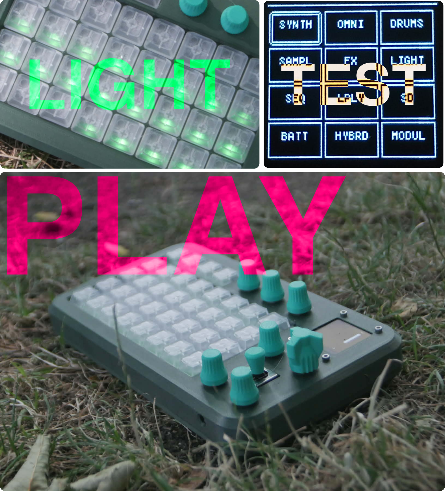
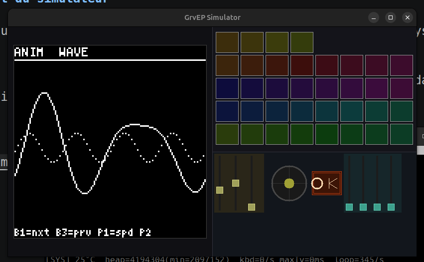

# GrvEP



GrvEP est une boîte à rythmes / synthétiseur portable basée sur un ESP32-S3 :
séquenceurs de drums, synthés (soustractif, TB-303, PCM, granulaire, échantillonneur...),
lecture de samples depuis une carte SD, écran OLED, clavier de 16 touches, joystick,
potentiomètres et LEDs adressables (FastLED) pour le retour visuel.

Le même code applicatif (`src/`) tourne sur trois cibles :

- **ESP32-S3** — le matériel réel, via [PlatformIO](https://platformio.org/).
- **Simulateur desktop Linux** — une reconstruction de la carte (écran, clavier, joystick, LEDs) en SDL2, pour développer/tester sans le matériel.
- **APK Android** — le même simulateur SDL2, compilé nativement en C++ pour Android (pas de wrapper web).

## Build pour l'ESP32

Prérequis : [PlatformIO](https://platformio.org/install/cli) (`pip install platformio` ou l'extension VSCode).

```bash
# Compiler
pio run -e esp32-s3-devkitc-1

# Compiler et flasher (carte branchée en USB)
pio run -e esp32-s3-devkitc-1 -t upload

# Moniteur série
pio run -e esp32-s3-devkitc-1 -t monitor
```

La configuration de build (partitions 16MB, PSRAM, USB MIDI...) est définie dans [platformio.ini](platformio.ini).

## Build et lancement du simulateur

Le simulateur reproduit le firmware sur Linux avec SDL2 (fenêtre, clavier, joystick, LEDs simulées).

Prérequis : `cmake`, un compilateur C++, `libsdl2-dev` (un `.deb` est fourni dans `simulator/` si besoin d'une install hors-ligne).





```bash
cd simulator
./build.sh

# Lancer
DISPLAY=:1 ./build/grvep_sim
```

Le binaire est produit dans `simulator/build/grvep_sim`.

## Build d'un .exe Windows (cross-compilation depuis Linux)

Un exécutable Windows tout-en-un (statiquement lié : ni SDL2.dll, ni libstdc++/libwinpthread
à côté, pas de fenêtre console) peut être compilé depuis Linux via MinGW-w64 :

```bash
cd simulator
./build_windows.sh
```

Au premier lancement, le script télécharge et extrait (sans root/sudo) le compilateur croisé
et les fichiers de dev SDL2 dans `simulator/.winbuild-toolchain/` (~250 Mo, ignoré par git) ;
les lancements suivants réutilisent ce cache. Le résultat est `simulator/GrvEP.exe` — un seul
fichier à copier sur une machine Windows et à double-cliquer, sans installation.

Un exécutable déjà compilé est disponible dans
[releases/GrvEP-windows.exe](releases/GrvEP-windows.exe).

Limitation connue : la lecture de fichiers `.mp3` n'est pas disponible dans le build Windows
(le simulateur Linux s'appuie sur `libmpg123` via `dlopen`, sans équivalent simple côté
Windows) — les échantillons `.wav` et tout le reste du firmware ne sont pas affectés.

## Build et installation de l'APK Android

L'APK embarque directement le simulateur (SDL2 + C++, sans WebView) : `libmain.so` contient
le firmware complet (SDL2 + moteur audio AMY + rendu U8g2), affiché en résolution logique
820×560 mise à l'échelle sur l'écran du téléphone. Les touches, le joystick et les potards
sont pilotés au tactile.

Un APK déjà compilé est disponible dans [releases/GrvEP.apk](releases/GrvEP.apk) — il suffit de le
copier sur le téléphone, d'activer "Sources inconnues" dans les paramètres de sécurité, puis
de l'ouvrir pour l'installer (ou `adb install -r releases/GrvEP.apk`).

Pour le (re)compiler soi-même :

```bash
# Première fois seulement : télécharge JDK 21, NDK 26.1 et les sources SDL2
cd android-native
./setup_android.sh
cd ..

# Build (debug, signé avec la clé de debug — installable directement)
./build_native_apk.sh

# Build + installation directe via adb (téléphone branché en USB)
./build_native_apk.sh --install

# Build release (non signé)
./build_native_apk.sh --release
```

L'APK compilé se trouve dans `android-native/app/build/outputs/apk/debug/app-debug.apk`
(ou `release/app-release-unsigned.apk`). Voir [android-native/README.md](android-native/README.md)
pour le détail de l'architecture.
